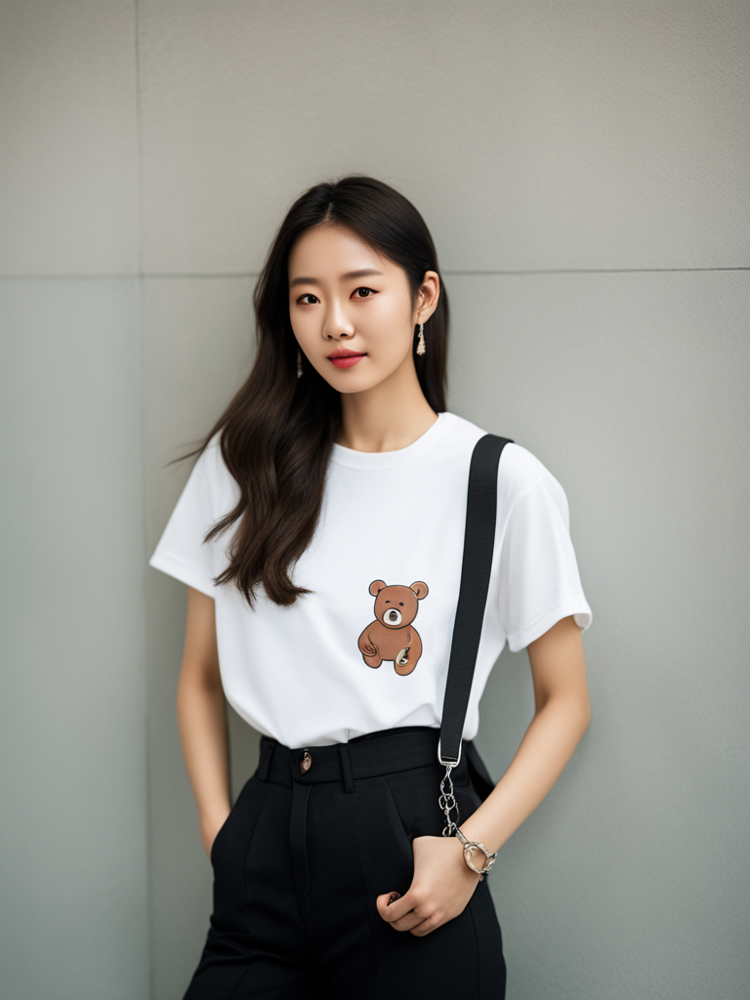

# MUSINSA-IGO (MUSINSA fashion Image Generative Operator)
- - -
## MUSINSA-IGO 3.0 is a text-to-image generative model that fine-tuned [*Stable Diffusion XL 1.0*](https://huggingface.co/stabilityai/stable-diffusion-xl-base-1.0) with LoRA using street snaps downloaded from the website of [Musinsa](https://www.musinsa.com/app/), a Korean fashion commerce company. This is very useful for generating fashion images.

### Examples
- - -


### Notes
- - -
* For example, the recommended prompt template is shown below.  

**Prompt**: RAW photo, fashion photo of *subject*, (high detailed skin:1.2), 8k uhd, dslr, soft lighting, high quality, film grain, Fujifilm XT3
  
**Negative Prompt**: (deformed iris, deformed pupils, semi-realistic, cgi, 3d, render, sketch, cartoon, drawing, anime:1.4), text, close up, cropped, out of frame, the worst quality, low quality, jpeg artifacts, ugly, duplicate, morbid, mutilated, extra fingers, mutated hands, poorly drawn hands, poorly drawn face, mutation, deformed, blurry, dehydrated, bad anatomy, bad proportions, extra limbs, cloned face, disfigured, gross proportions, malformed limbs, missing arms, missing legs, extra arms, extra legs, fused fingers, too many fingers, long neck

* The model is available in [this *Huggingface Hub* repository](https://huggingface.co/aldente0630/musinsaigo-3.0).

* It is recommended to apply a cross-attention scale of 0.5 to 0.75 and use a refiner.

### Usage
- - -
```python
import torch
from diffusers import DiffusionPipeline


def make_prompt(prompt: str) -> str:
    prompt_prefix = "RAW photo"
    prompt_suffix = "(high detailed skin:1.2), 8k uhd, dslr, soft lighting, high quality, film grain, Fujifilm XT3"
    return ", ".join([prompt_prefix, prompt, prompt_suffix]).strip()


def make_negative_prompt(negative_prompt: str) -> str:
    negative_prefix = "(deformed iris, deformed pupils, semi-realistic, cgi, 3d, render, sketch, cartoon, drawing, anime:1.4), \
    text, close up, cropped, out of frame, worst quality, low quality, jpeg artifacts, ugly, duplicate, morbid, mutilated, \
    extra fingers, mutated hands, poorly drawn hands, poorly drawn face, mutation, deformed, blurry, dehydrated, bad anatomy, \
    bad proportions, extra limbs, cloned face, disfigured, gross proportions, malformed limbs, missing arms, missing legs, \
    extra arms, extra legs, fused fingers, too many fingers, long neck"

    return (
        ", ".join([negative_prefix, negative_prompt]).strip()
        if len(negative_prompt) > 0
        else negative_prefix
    )


device = "cuda" if torch.cuda.is_available() else "cpu"

model_id = "aldente0630/musinsaigo-3.0"
pipe = DiffusionPipeline.from_pretrained(
    "stabilityai/stable-diffusion-xl-base-1.0", torch_dtype=torch.float16
)
pipe = pipe.to(device)
pipe.load_lora_weights(model_id)

# Write your prompt here.
PROMPT = "a korean woman wearing a white t - shirt and black pants with a bear on it"  
NEGATIVE_PROMPT = ""

# If you're not using a refiner
image = pipe(
    prompt=make_prompt(PROMPT),
    height=1024,
    width=768,
    num_inference_steps=50,
    guidance_scale=7.5,
    negative_prompt=make_negative_prompt(NEGATIVE_PROMPT),
    cross_attention_kwargs={"scale": 0.75},
).images[0]

# If you're using a refiner
refiner = DiffusionPipeline.from_pretrained(
    "stabilityai/stable-diffusion-xl-refiner-1.0",
    text_encoder_2=pipe.text_encoder_2,
    vae=pipe.vae,
    torch_dtype=torch.float16,
)
refiner = refiner.to(device)

image = pipe(
    prompt=make_prompt(PROMPT),
    height=1024,
    width=768,
    num_inference_steps=50,
    guidance_scale=7.5,
    negative_prompt=make_negative_prompt(NEGATIVE_PROMPT),
    output_type="latent",
    cross_attention_kwargs={"scale": 0.75},
)["images"]

generated_images = refiner(
    prompt=make_prompt(PROMPT),
    image=image,
    num_inference_steps=50,
)["images"]

image.save("test.png")
```


### References

---
* [Zero-Shot Image-to-Text Generation with *BLIP-2*](https://huggingface.co/blog/blip-2?fbclid=IwAR1iTzu7a_2zSv6dyeQt2dlgEtPFDQTfcvXoudOgeVMDin4IGP8fUz61ZL8)  
* [How to Fine-Tune *Stable Diffusion* Using *LoRA*](https://ngwaifoong92.medium.com/how-to-fine-tune-stable-diffusion-using-lora-85690292c6a8)   
* [Using *LoRA* for Efficient Stable Diffusion Fine-Tuning](https://huggingface.co/blog/lora)
