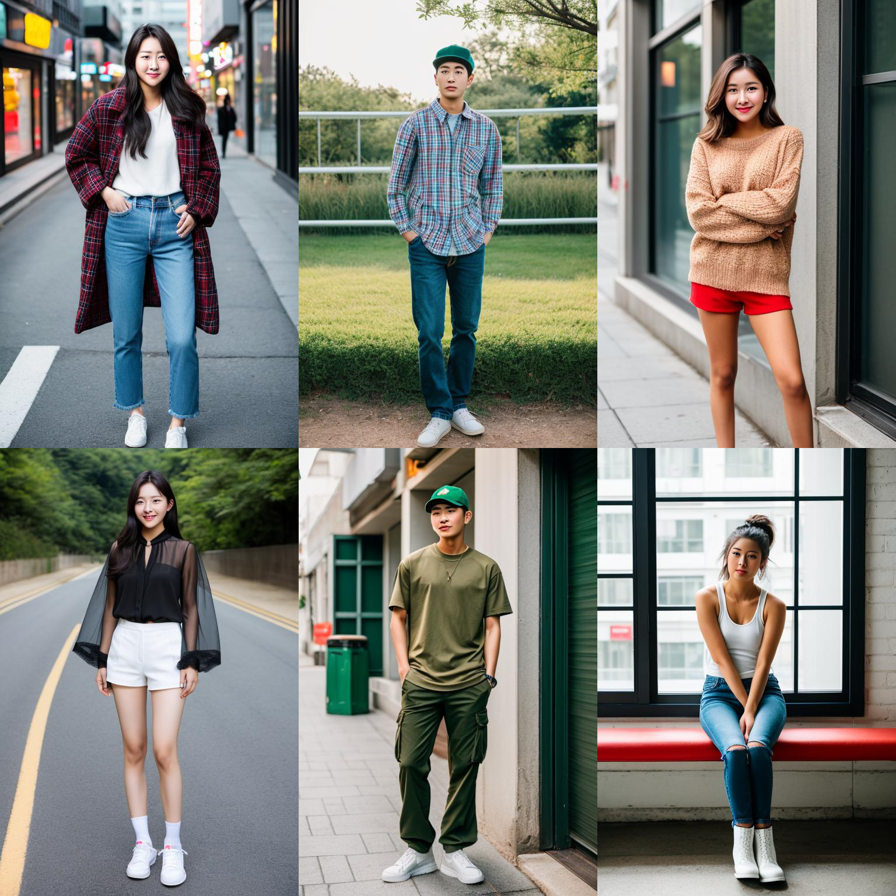
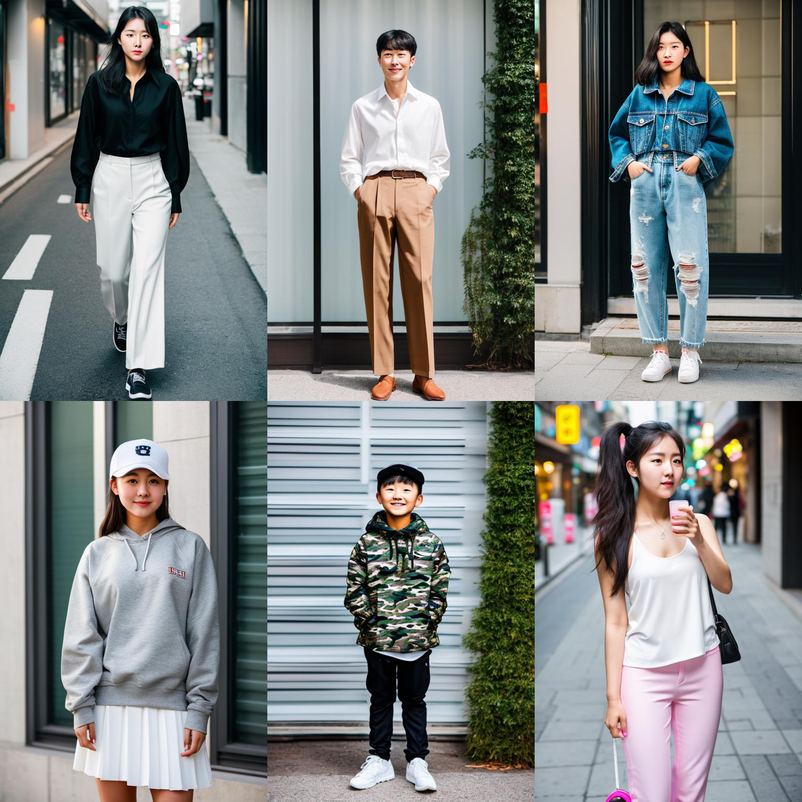
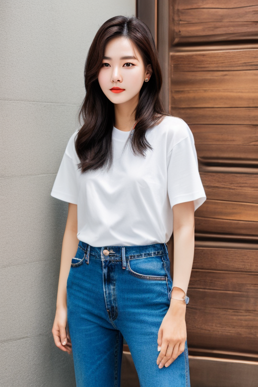

---
language:
- en
license: creativeml-openrail-m
tags:
- stable-diffusion
- stable-diffusion-diffusers
- diffusers
- text-to-image
- fashion
- ecommerce
inference: false
---

# MUSINSA-IGO (MUSINSA fashion Image Generative Operator)
- - -
## MUSINSA-IGO 1.0 is a text-to-image generative model that fine-tuned [*Realistic Vison 5.1*](https://huggingface.co/SG161222/Realistic_Vision_V5.1_noVAE) with street snaps downloaded from the website of [Musinsa](https://www.musinsa.com/app/), a Korean fashion commerce company. This is very useful for generating fashion images.

### Examples
- - -


### Notes
- - -
* The recommended prompt templates inherit from those of the *Realistic Vison 5.1* model, for example,  

**Prompt**: RAW photo, fashion photo of *subject*, (high detailed skin:1.2), 8k uhd, dslr, soft lighting, high quality, film grain, Fujifilm XT3
  
**Negative Prompt**: (deformed iris, deformed pupils, semi-realistic, cgi, 3d, render, sketch, cartoon, drawing, anime:1.4), text, close up, cropped, out of frame, the worst quality, low quality, jpeg artifacts, ugly, duplicate, morbid, mutilated, extra fingers, mutated hands, poorly drawn hands, poorly drawn face, mutation, deformed, blurry, dehydrated, bad anatomy, bad proportions, extra limbs, cloned face, disfigured, gross proportions, malformed limbs, missing arms, missing legs, extra arms, extra legs, fused fingers, too many fingers, long neck

* The source code is available in [this *GitHub* repository](https://github.com/aldente0630/musinsaigo).

### Usage
- - -
```python
import torch
from diffusers import StableDiffusionPipeline


def make_prompt(prompt: str) -> str:
    prompt_prefix = "RAW photo"
    prompt_suffix = "(high detailed skin:1.2), 8k uhd, dslr, soft lighting, high quality, film grain, Fujifilm XT3"
    return ", ".join([prompt_prefix, prompt, prompt_suffix]).strip()


def make_negative_prompt(negative_prompt: str) -> str:
    negative_prefix = "(deformed iris, deformed pupils, semi-realistic, cgi, 3d, render, sketch, cartoon, drawing, anime:1.4), \
    text, close up, cropped, out of frame, worst quality, low quality, jpeg artifacts, ugly, duplicate, morbid, mutilated, \
    extra fingers, mutated hands, poorly drawn hands, poorly drawn face, mutation, deformed, blurry, dehydrated, bad anatomy, \
    bad proportions, extra limbs, cloned face, disfigured, gross proportions, malformed limbs, missing arms, missing legs, \
    extra arms, extra legs, fused fingers, too many fingers, long neck"

    return (
        ", ".join([negative_prefix, negative_prompt]).strip()
        if len(negative_prompt) > 0
        else negative_prefix
    )

device = "cuda" if torch.cuda.is_available() else "cpu"

model_id = "aldente0630/musinsaigo-1.0"
pipe = StableDiffusionPipeline.from_pretrained(model_id, torch_dtype=torch.float16)
pipe = pipe.to(device)

# Write your prompt here.
PROMPT = "a korean woman in a white t - shirt and jeans"  
NEGATIVE_PROMPT = ""

image = pipe(
    prompt=make_prompt(PROMPT),
    height=768,
    width=512,
    num_inference_steps=50,
    guidance_scale=7.0,
    negative_prompt=make_negative_prompt(NEGATIVE_PROMPT),
).images[0]

image.save("test.png")
```

